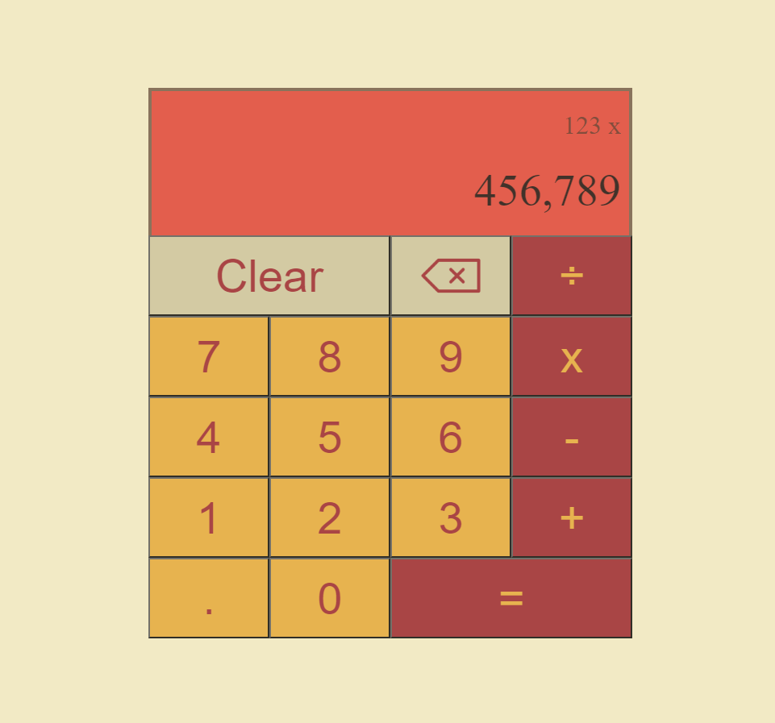

# Project: Calculator

## Overview

This project aims to create a simple calculator application using HTML, CSS, and JavaScript. The calculator will perform basic arithmetic operations such as addition, subtraction, multiplication, and division. The goal is to provide a user-friendly interface with intuitive button layouts and responsive design.

Try to solve except your problems [here](https://krig6.github.io/odin-calculator/)

## Sample

## Technologies Used

- HTML: Provides the structure and layout of the web page.
- CSS: Styles the buttons on the calculator for a more interactive experience.
- JavaScript: Implements the functionalities of a Calculator.

## Features

- Basic Arithmetic Operations: Addition, subtraction, multiplication and division.
- Clear and Delete buttons: Start fresh or delete a number.
- Visual Separation: To avoid confusion, visually separate current and previous inputs.
- Auto-calculate: Calculate inputs with the use of operators.

## Learning Path

During this project, I encountered challenges with utilizing class constructors. While I managed to create a functional calculator using an array of functions and event listeners, my recent exposure to Object Basics through The Odin Project inspired me to adopt this approach for my project. Seeking guidance, I turned to Web Dev Simplified, who provided clear instruction on constructing my calculator using classes.

## Future Enhancements

- Additional buttons: Square root, percentage, modulo
- Ability to calculate negative inputs
